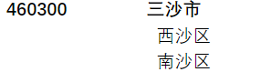

# 行政区划代码
### 获取历年行政区划代码

生成1980到2020的所有区域数据，放到`中国区域信息表.xlsx`，具体过程如下:

- 从网页[中华人民共和国民政部 (mca.gov.cn)](http://www.mca.gov.cn/article/sj/xzqh/1980/?)找到行政区划分总览，然后进去，拷贝每个年份的url链接地址。

- 除2013和2014外，通过网页链接爬取内容，然后将其正则匹配，存放到xlsx表格中

- 2013和2014，格式如下：https://files2.mca.gov.cn/cws/201404/20140404125552372.htm，采用的是https方式，直接爬虫获取不到，打开网页，将内容copy到一个txt文件中，在正则匹配到表格当中

- 2020年的数据中，编码比名字少了两个，如下所示

### 比较任意两年的行政区变化

